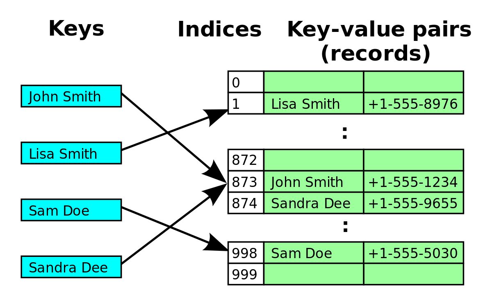

# hashtable

A hashtable is a way to implement an associative array. This is a data structure that allows non-integer indices to access data (such as Strings or other objects)

Think of it as data structure to use non-integers to access the array slots.

The k,i,and j are often called keys in this context.  

Storing the keys by themselves would just be a set. The data structure either contains the key or not. This is helpful if you want to find duplicates, or just quickly determine if something is present or not.

You can also store the keys by themselves, or store associated values. (Hence the term associative array)

Examples of key:value pairs would be:

- personName : phoneNumber

- personName : job

- productName : inventoryQuantity

# hash function

We can write a function to convert the key into a hash code (data type would be integer). That hash code can then be used as the index to an array.

We often create a large number with the hash function, then use a remainder operator to limit the value to match the size of the array we store things in.

Putting this together we can use the hash function on names, to find the slot in the array, and then use that slot to store a phone number or other data.

# Until we have collisions

This utopian idea breaks down very quickly when we have too many values, because there will always be a chance that your hashcode matches the hashcode of another item.

When two keys map to the same hashcode (thus slot in the array), we have a collision. This requires we come up with a way to handle collisions without slowing down the data structure

# Open Addressing

Open addressing means we will use the next available slot when we have a collision. We just look at the next slot, then the next until there is an empty one.

# Separate Chaining

An alternate and often faster method is to use a list data structure to store the collisions in the same slot they were supposed to be plced.

If Jack and Andrew both go into the same slot, then we just place BOTH in that slot. The runtime to look at all of the elements in a given slot is linear with respect to the number of collisions in that slot, which will be very small on average. [  O(number of collision in that slot) ]

