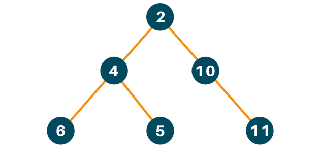
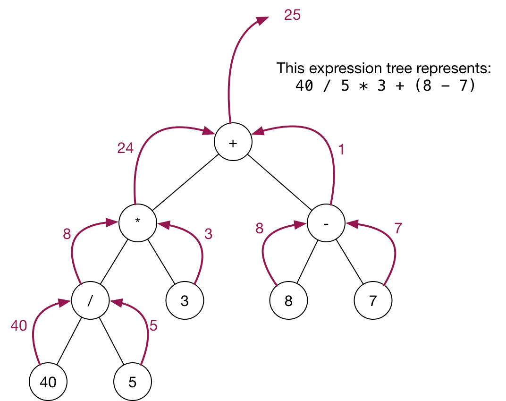

# Activities

The activities are at the bottom of the page:

<a href="#activity0">Activity0: set up file structure</a>

<a href="#activity1">Activity1: toString diagram</a>

<a href="#activity2">Activity2: toString coding</a>

<a href="#activity3">Activity3: evaluate coding</a>

# Binary Tree

A binary tree is a data structure where each node has at most 2 children. (That is 0,1 or 2 children) This is similar to the linked list, but there are left and right nodes, that when combined split into a "tree like" structure.

The nodes can contain data just like your linked list. In fact we could use a tree to act like a container for values like a list if we wanted.



# Children
In the example above:

nodes 2 and 4: both have two children (nodes below them left and right)

node 10: has only one child.

Nodes 6, 5, and 11: have no children.

# ExpressionTree

We will be working with a variation on a binary tree. Instead of all the nodes being values, some will be numerical values, and others will be math operators.


## We will define an ExpressionTree to be a special binary tree that represents an arithmetic expression.


1. The values and calculations will always be double, so we don't have integer division, and we cannot store booleans/Strings/char etc.

2. An ExpressionTree has 0 or 2 children.

3. An ExpressionTree with 0 children must be a double.

4. An ExpressionTree with 2 children must be one of these characters: '+', '-', '*', '/'. We will interpret these as the java operation that the symbol represents.

5. A child of an ExpressionTree is an ExpressionTree. (Looking at the example above, the topmost element is a node that tells us to multiply. That node has 2 children, each of which are expression trees. )

6. We will not be able to alter the order of operations with parenthesis, or use unary operators (e.g. sqrt(), sin() ) it is meant to be a simple expression representation. It is limited in its features and this is intended to keep things less complex.

# Examples:

## A single value is a tree, but it doesn't look like a tree:

```10```

## An ExpressionTree with 2 children is connecting two trees with an operator.

This Example is equivalent to `(6.0 - 4.0)` so when evaluated it would be `2.0`
```
  '-'
  /  \
6.0  4.0
```

## Since the children are `ExpressionTree`, this means you can put an expression as a child:

This Example is equivalent to `(3.0 + (2.0 * 10.0))` so when evaluated it would be `23.0`
```
    '+'
   /   \
  3.0   '*'
       /  \
     2.0  10.0
```
This Example is equivalent to `(3.0 / (6.0 - 4.0))` so when evaluated it would be `1.5`
```
     '/'
   /   \
  3.0   '-'
       /  \
     6.0  4.0
```

# There are two constructors to model this concept:

```java
//The tree can be a value
public ExpressionTree(double val){
 value = val;
 left = null;
 right = null;
}
```
```java
//The tree can be an operator that connects two sub-trees
public ExpressionTree(char op, ExpressionTree l, ExpressionTree r){
  operator = op;
  left = l;
  right =r;
}
```

# Building a tree:

We can connect these constructors to make more complex trees.

I highly recommend using variables to store partial trees as shown in the examples.

Single value trees
```java
ExpressionTree one = new ExpressionTree(1.0);
ExpressionTree two = new ExpressionTree(2.0);
ExpressionTree three = new ExpressionTree(3.0);//
```
Compose the single values into more complex trees:
```java
ExpressionTree a = new ExpressionTree('+',one,one); //"(1.0+1.0) evaluates to 2"
ExpressionTree d = new ExpressionTree('/',one,two);//"(1.0/2.0) evaluates to 0.5"
```
Which yeilds:
```
  '+'
  /  \
1.0  1.0
```
and
```
   '/'
  /  \
1.0  2.0
```

More? Here:
```java
ExpressionTree more = new ExpressionTree('-',a,d); //"((1.0+1.0)-(1.0 / 2.0))"
ExpressionTree evenMore = new ExpressionTree('*',more,three); //"(((1.0+1.0)-(1.0 / 2.0))*3)"
```
This gives us:
```
      '-'
    /     \
  '+'      '/'
  /  \     /  \
1.0  1.0  1.0  2.0
```
and
```
          `*`
         /    \
      '-'     3.0
    /     \
  '+'      '/'
  /  \     /  \
1.0  1.0  1.0  2.0
```
# Provided methods of an ExpressionTree

These are private methods you will be provided (in addition to the two constructors mentioned)

They will help you write the public methods.

`boolean isValue()` - true when the node is a value, false when it is an operator

`boolean isOperator()` - false when the node is a value, true when it is an operator

`double apply(double a, double b, char op)` - Op will be a one character that corresponds to the 4 math operations +, -, \*, /. This function returns the result of the math calcualtion.

e.g. `apply(2,5,'+')`  returns `7`. `apply(1,2,'/')`  returns `0.5`.

# Method to diagram and write : toString()

`toString()` - return the one line String representation of the tree. e.g.

`"10.0"`

`"(1.0/3.5)"`

`"(10-(1.0/3.5))"`

<p id="activity0"></p>

## Activity 0. Setup your files.

Make a directory under your ds/ called `trees` to store the work for this topic.

Copy `ExpressionTree.java` and `TreeDriver.java` files into this folder as well.

<p id="activity1"></p>

## Activity 1. Diagram toString()

Create a file to store your diagramming of the method. Name it `planning.?`   (e.g. `planning.draw` , `planning.pdf` , or `planning.jpg` )

You should now have `ds/trees/planning.whatever`

Create a diagram of the recursive toString() method and how it should work. Use pseudocode to explain the diagram.

Hint: It might be helpful to use the three examples above to get started, though it is not necessary.

<p id="activity2"></p>

## Activity 2. Write toString()

# Method to write : Evaluate

`evaluate()` - return the result of the tree.

## example1 should return 0.5 :

```
   '/'
  /  \
1.0  2.0
```

in code:

```java
ExpressionTree d = new ExpressionTree('/',one,two);
System.out.println(d.evaluate());//returns 0.5
```


## Example2:
### If you had a tree that represented : `(((40/5)*3)+(8-7))`



<p id="activity3"></p>

## Activity 3. Write evaluate()

Evaluate will follow the same basic structure as toString() so you are equipped to tackle this method.

Note that you can break down evaluate into the same base and recursive case as toString() so you probably don't need to diagram something new!

## Challenge Activity1 - Write toStringPrefix()

The way we write our mathematical operators is called infix notation. This just means the operator (+,-,* etc.) is in between the operands (numbers or variables).

When we write functions in programming languages that syntax is actually prefix notation (the operator or function name comes first).


|Name | Format| Where is it used|
|---|---|---|
|infix notation:|    `(a + b)`| you already use this most of the time|
|Prefix notation:|    `(+ a b)` | casio calculators, Lisp, Scheme |
|Postfix notation: |  `(a b +)`| HP calculators, |

Prefix and postfix with math operators is used in some types of calculators and programming languages.

Remember you use prefix with method calls! If you created a method to add two values it would be used as follows:

`add(10,5)` is just `(+ 10 5)`

Similarly:

`fact(10)` is the same as the postfix math operator for factorial `10!`

## The actual activity:

Write `String toStringPrefix()` method that displays the tree in prefix notation.

e.g.
```
   '/'
  /  \
1.0  2.0
```
Would become `"(/ 1.0 2.0)"`
Note the space between 1.0 and 2.0 is required.

```
          `*`
         /    \
      '-'     3.0
    /     \
  '+'      '/'
  /  \     /  \
1.0  1.0  1.0  2.0
```
would toStringPrefix() into:

`"(* (- (+ 1.0 1.0) (/ 1.0 2.0)) 3.0)"`
Note the spaces between values are required.
